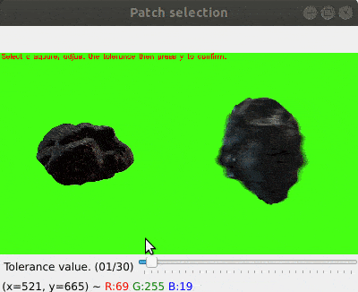

# Background Matting

Use this script to do [**chroma keying**](https://en.wikipedia.org/wiki/Chroma_key) : the background of a video, with uniform color, is replaced with another background. Usually, the background is colored green, but you can have other colors.

**Pre-requesites :** You should have a video with green (or any other color) background, as well as the picture of the background ( `background.jpeg` ).

## Usage

You will find the usage instructions in the module docstring.

## Principle

To achieve the chroma keying, the main task is to compute a binary mask representing the background. 

The selected green patch is used as a reference, which is converted to the `HSV` format (better suited for color processing).
The mean `hue` value of this patch is then computed. 

Finally, the **tolerance** controls how far away from this mean value  the background `hue` should be : all pixel  whose `hue` satisfies the condition  is part of the background.

(To render math equations in githud markdowns, I am using this [hack](https://gist.github.com/a-rodin/fef3f543412d6e1ec5b6cf55bf197d7b.))