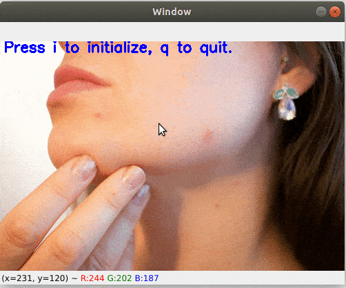

# Blemish Removal.

You can remove blemishes (acne, mark, flaw, ...) on a face's image using this script. An example image is included ( [`blemish.png`](blemish.png) ).

## Usage

- In the `__main__` of the script `blemishRemoval.py`, input the image path : 
```python
...
if __name__ == "__main__":
    image = cv2.imread("path/to/img", cv2.IMREAD_COLOR)
...
```

- Execute the script : 
```bash
$ python blemishRemoval.py
```

- On the image, click on any spot containing a blemish, and it will be smoothed.

