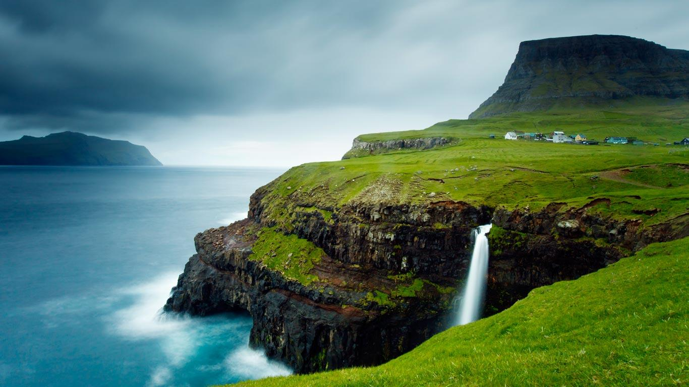

# Filter : Sunglasses 

This script will put sunglasses on a face. To add more realism, a background is reflected on the sunglasses.

The coordinates of the `sunglass.png` is hard-coded, so it's fixed.

## Usage

- Input the face image and background :
```python
img = cv2.imread("path/to/img") # face image
...
landscape = cv2.imread("background.jpeg", cv2.IMREAD_COLOR) # background
```

| Face                    |        Sunglasses           | Background                     |
|:-----------------------:|:---------------------------:|:------------------------------:|
|  |  |  |

- Execute the script, and the result is displayed :


